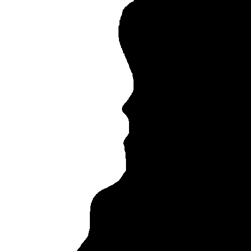

# Radar simulator
This project aims to simulate a radar located on the coast to observe the target is a ship, which includes CFAR and Kalman Filter algorithm, using Python and PyQt5 GUI framework.

## How to run
Install dependencies
```sh
pip install -r requirements.txt
```

Edit file `map.png` by yourself to create your own terrain. This image must be binary image, i.e. only contains black and white pixels. You can edit simply by MS Paint.



Run the program
```sh
python main.py
```

You should get the result as bellow:

